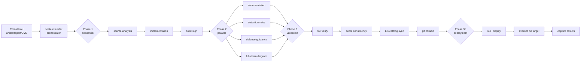

# f0_library — Security Testing Framework

[](https://github.com/ubercylon8/f0_library/actions/workflows/build.yml)
[](https://github.com/ubercylon8/f0_library/actions/workflows/security.yml)
[](https://opensource.org/licenses/Apache-2.0)
[](https://www.shellcheck.net/)

A comprehensive security testing framework for evaluating endpoint detection and response (EDR) capabilities against real-world attack techniques mapped to the MITRE ATT&CK framework.

> **Project naming**: **`f0_library`** is the framework. **F0RT1KA** is the parent organization / brand (used in binary signing certificates, the runtime path `c:\F0` / `/tmp/F0`, and elsewhere). The two are not competing names — `f0_library` is what this software is called.

## Overview

`f0_library` is a professional, open-source security testing framework designed to assess the effectiveness of endpoint detection and response (EDR) solutions. By simulating real-world attack techniques mapped to the MITRE ATT&CK framework, it provides security teams with a standardized approach to validate their defensive capabilities.

## Purpose

- **Security Validation**: Test and validate the detection and prevention capabilities of security solutions
- **MITRE ATT&CK Alignment**: All tests are mapped to specific MITRE ATT&CK techniques for standardized threat assessment
- **Automated Testing**: Provide a structured approach to security testing with consistent result codes
- **Research & Development**: Enable security teams to understand gaps in their defensive posture
- **Compliance Support**: DORA/TIBER-EU aligned testing for regulatory compliance

## Key Features

- **51 Security Tests** across 3 categories covering attack simulation and configuration validation
- **Cross-Platform Support**: Windows (primary), Linux, and macOS test targets
- **Agent-Driven Test Generation**: Orchestrator + specialized agents for automated test creation from threat intelligence
- **5 Detection Rule Formats**: KQL, YARA, Sigma, Elastic EQL, and LimaCharlie D&R rules generated per test
- **Defense Guidance**: Hardening scripts (Windows/Linux/macOS) and incident response playbooks
- **Standardized Test Structure**: Schema v2.0 logging with Elasticsearch analytics
- **Realism-First Scoring (Rubric v2.1)**: Tiered safety/realism/structure scoring that decouples test quality from tenant defense posture (see [Test Quality Scoring](#test-quality-scoring))
- **Multi-Organization Support**: UUID-based organization tracking for enterprise deployments
- **LimaCharlie Integration**: Infrastructure as Code for detection rules and certificate deployment
- **Elasticsearch Analytics**: Pre-built dashboards and enrichment pipelines
- **Code Signing Support**: Integrated Windows executable signing with dual-signing for ASR bypass
- **Test Provenance**: References tracking with `_references.md` files linking tests to source intelligence

## Test Categories

| Category | Tests | Description |
|----------|-------|-------------|
| [**intel-driven**](tests_source/intel-driven/) | 33 | Threat intelligence-based tests from APT reports, ransomware analysis, and CVE exploits |
| [**mitre-top10**](tests_source/mitre-top10/) | 10 | MITRE Top 10 Ransomware techniques test suite |
| [**cyber-hygiene**](tests_source/cyber-hygiene/) | 8 | Configuration validation tests for endpoint, identity, and tenant security |

## Agent Architecture

`f0_library` uses a decomposed agent architecture to generate complete test packages from threat intelligence. The `sectest-builder` orchestrator coordinates specialized skills and sub-agents in a 4-phase execution model.



### Execution Phases

1. **Phase 1 — Sequential Skills** (shared context): Source analysis → Go implementation → Build & sign
2. **Phase 2 — Parallel Agents** (independent): Documentation, detection rules, defense guidance, kill chain diagrams
3. **Phase 3 — Validation** (shared context): File verification, score consistency, ES catalog sync, git commit
4. **Phase 3b — Deployment** (shared context): SSH deploy to target endpoint, execute, capture results

### Agent Selection

| Need | Agent |
|------|-------|
| Create test from threat intel | `@sectest-builder` (orchestrates everything) |
| Validate TIBER-EU phase readiness | `@pentest-readiness-builder` |
| Visualize attack flow | `@attack-flow-diagram-builder` |
| Visualize kill chain | `@kill-chain-diagram-builder` |
| Generate detection rules | `@sectest-detection-rules` |
| Generate defense guidance | `@sectest-defense-guidance` |
| Deploy & execute test on endpoint | `@sectest-deploy-test` |

For detailed architecture documentation, see [docs/SECTEST_BUILDER_ARCHITECTURE.md](docs/SECTEST_BUILDER_ARCHITECTURE.md).

## Project Structure

```
f0_library/
├── .claude/                      # Claude Code agent and skill definitions
│   ├── agents/                  # 9 specialized agents (orchestrator + sub-agents)
│   └── skills/                  # 6 skills (analysis, implementation, build, validation, deploy)
├── .github/                      # GitHub workflows and templates
│   ├── ISSUE_TEMPLATE/          # Issue templates for bugs and features
│   ├── workflows/               # CI/CD workflows (build, security, Claude review)
│   └── pull_request_template.md
├── docs/                         # Documentation (20 files)
│   ├── ARCHITECTURE.md          # System architecture (multi-binary bundles)
│   ├── CHANGELOG.md             # Version history
│   ├── DEVELOPMENT.md           # Developer setup guide
│   ├── DUAL_SIGNING_STRATEGY.md # Code signing details
│   ├── F0RT1KA_SCORING_METHODOLOGY.md # Test scoring methodology
│   ├── MULTISTAGE_QUICK_REFERENCE.md  # Multi-stage build reference
│   ├── SECTEST_BUILDER_ARCHITECTURE.md # Agent architecture
│   ├── TEST_RESULTS_SCHEMA_GUIDE.md   # Schema v2.0 guide
│   ├── ELASTICSEARCH_EXPORT_QUICKSTART.md # ES export guide
│   └── ...                      # Additional docs
├── limacharlie-iac/              # LimaCharlie Infrastructure as Code
│   ├── elasticsearch/           # Elasticsearch index templates
│   ├── payloads/                # PowerShell scripts and payloads
│   ├── rules/                   # Detection & Response rules
│   ├── scripts/                 # Deployment automation
│   └── README.md                # LimaCharlie deployment guide
├── sample_tests/                 # Reference test implementations
│   └── multistage_template/     # Multi-stage test reference
├── tech-reports/                 # Threat intelligence research documents
├── tests_source/                 # Active test development directory
│   ├── intel-driven/            # Threat intelligence-based tests (28)
│   ├── mitre-top10/             # MITRE Top 10 Ransomware tests (10)
│   └── cyber-hygiene/           # Configuration validation tests (8)
├── utils/                        # Build, signing, and analysis utilities
│   ├── gobuild                  # Cross-platform test builder
│   ├── codesign                 # Code signing utility
│   ├── f0_collector             # Test result collector
│   ├── validate                 # Test validation suite
│   ├── validate_test_results.py # Schema v2.0 validator
│   ├── validate-score-format.sh # Score format checker
│   ├── validate-reference-urls.py # Reference URL validator
│   ├── sync-test-catalog-to-elasticsearch.py
│   ├── analyze_test_results.py  # Test result analyzer
│   ├── combine_test_results.py  # Result combiner
│   ├── get_tests.py             # Test catalog lister
│   ├── create-kibana-dashboard.py # Kibana dashboard generator
│   ├── defender_alert_query.py  # Defender alert querying
│   ├── lc_events_query.py       # LimaCharlie event querying
│   ├── generate-synthetic-test-data.py # Synthetic test data
│   ├── Check-DefenderProtection.ps1
│   ├── Monitor-RegistryChanges.ps1
│   └── README.md                # Utility documentation
├── rules/                        # Development guidelines
├── signing-certs/                # Code signing certificates
├── preludeorg-libraries/         # Prelude testing framework (setup required)
├── CONTRIBUTING.md              # Contribution guidelines
├── CODE_OF_CONDUCT.md           # Community standards
├── SECURITY.md                  # Security policy
├── LICENSE                      # MIT License
└── README.md                    # This file
```

## Getting Started

### Prerequisites

- **Go 1.21+**: Required for building tests
- **Python 3.7+**: Required for utilities and ES sync scripts
- **Supported platforms**: Windows (primary), Linux, macOS
- **Prelude Libraries**: Must be configured in the `preludeorg-libraries/` directory
- **Administrator Access**: Some tests require elevated privileges
- **osslsigncode** (optional): For code signing Windows executables

### Quick Start

1. **Clone the repository**:
```bash
git clone https://github.com/ubercylon8/f0_library.git
cd f0_library
```

2. **Set up Python virtual environment** (for utilities):
```bash
python3 -m venv .venv
source .venv/bin/activate
pip install -r utils/requirements.txt  # Core deps; also install elasticsearch for ES sync
```

3. **Read the documentation**:
   - [Development Guide](docs/DEVELOPMENT.md) - Complete setup instructions
   - [Architecture Overview](docs/ARCHITECTURE.md) - System design
   - [Contributing Guidelines](CONTRIBUTING.md) - How to contribute

4. **Set up Prelude libraries** (required for test compilation):
   Place the [Prelude OpenSource](https://github.com/preludeorg/libraries) tree under `preludeorg-libraries/` so test `go.mod` files can resolve `github.com/preludeorg/libraries/go/tests/endpoint`. See [docs/DEVELOPMENT.md](docs/DEVELOPMENT.md) for the exact directory layout used by `utils/gobuild`.

5. **Install dependencies** (optional):
```bash
# macOS
brew install osslsigncode

# Ubuntu/Debian
sudo apt-get install osslsigncode

# Windows
winget install Microsoft.WindowsSDK
```

### Building Tests

Use the provided `gobuild` utility for cross-platform compilation:

```bash
# Build a specific test (Windows/amd64 by default)
./utils/gobuild build tests_source/intel-driven/<test-uuid>/

# Build all tests in a category
for dir in tests_source/intel-driven/*/; do
    ./utils/gobuild build "$dir"
done

# Build all tests
./utils/gobuild build-all

# List available tests
./utils/gobuild list
```

### Cross-Platform Builds

```bash
# Windows (default)
GOOS=windows GOARCH=amd64 go build -o test.exe main.go test_logger.go test_logger_windows.go org_resolver.go

# Linux
GOOS=linux GOARCH=amd64 go build -o test main.go test_logger.go test_logger_linux.go org_resolver.go

# macOS (Apple Silicon)
GOOS=darwin GOARCH=arm64 go build -o test main.go test_logger.go test_logger_darwin.go org_resolver.go
```

### Code Signing

Sign Windows executables using the `codesign` utility:

```bash
# Sign a specific binary
./utils/codesign sign build/<test-uuid>/<test-uuid>.exe

# Dual-sign with organization certificate (for ASR bypass)
./utils/codesign sign-nested build/<test-uuid>/<test-uuid>.exe --org sb

# Sign all binaries in build directory
./utils/codesign sign-all

# Verify signature
./utils/codesign verify build/<test-uuid>/<test-uuid>.exe
```

### Running Tests

Deploy and execute tests on target systems:

```bash
# Copy test binary to target
scp build/<test-uuid>/<test-uuid>.exe user@target:c:/F0/

# Execute on target
ssh user@target "c:/F0/<test-uuid>.exe"

# Check results
cat c:/F0/test_execution_log.json
```

## Cross-Platform Support

Tests can target Windows, Linux, or macOS. The platform is determined by the threat being simulated.

| Platform | `LOG_DIR` | `ARTIFACT_DIR` | Binary Extension |
|----------|-----------|----------------|-----------------|
| Windows | `C:\F0` | `c:\Users\fortika-test` | `.exe` |
| Linux | `/tmp/F0` | `/home/fortika-test` | (none) |
| macOS | `/tmp/F0` | `/Users/fortika-test` | (none) |

Platform-specific logger files (`test_logger_windows.go`, `test_logger_linux.go`, `test_logger_darwin.go`) define these constants. Copy the shared `test_logger.go` AND the appropriate platform file from `sample_tests/multistage_template/` when creating new tests.

## Detection & Defense Artifacts

Each test generates detection rules in 5 formats and comprehensive defense guidance:

### Detection Rules

| Format | File | Target Platform |
|--------|------|-----------------|
| KQL | `<uuid>_detections.kql` | Microsoft Sentinel / Defender |
| YARA | `<uuid>_rules.yar` | File-based scanning |
| Sigma | `<uuid>_sigma_rules.yml` | Vendor-agnostic SIEM |
| Elastic EQL | `<uuid>_elastic_rules.ndjson` | Elastic SIEM |
| LimaCharlie D&R | `<uuid>_dr_rules.yaml` | LimaCharlie |

### Defense Guidance

| Artifact | File | Purpose |
|----------|------|---------|
| Defense Guide | `<uuid>_DEFENSE_GUIDANCE.md` | Consolidated detection + hardening |
| Windows Hardening | `<uuid>_hardening.ps1` | PowerShell hardening script |
| Linux Hardening | `<uuid>_hardening_linux.sh` | Bash hardening script |
| macOS Hardening | `<uuid>_hardening_macos.sh` | macOS hardening script |

## Test Development

### Test Result Codes

| Code | Name | Description |
|------|------|-------------|
| 101 | `Unprotected` | Attack succeeded - system unprotected |
| 105 | `FileQuarantinedOnExtraction` | File quarantined by AV/EDR |
| 126 | `ExecutionPrevented` | Execution blocked by security solution |
| 999 | `UnexpectedTestError` | Test prerequisites not met |

### Path Conventions

| Artifact Type | Path | Reason |
|--------------|------|--------|
| Test binaries (.exe) | `c:\F0` | Whitelisted - allows execution |
| Embedded tools | `c:\F0` | Same as above |
| Log files | `c:\F0` | Standard location |
| Simulation artifacts | `c:\Users\fortika-test` | NOT whitelisted - EDR detects |

### Test Quality Scoring

`f0_library` tests are scored under **Rubric v2.1** (active since 2026-04-25), a tiered realism-first model that separates test-property quality from tenant-defense posture:

| Tier | Weight | What it scores |
|------|--------|----------------|
| **Safety gate** | pass/fail | Reversibility, scope containment, no destructive side effects on the target host |
| **Realism** | 0–7 | API fidelity (2.5) + identifier fidelity (1.5) + telemetry signal quality (2.0) + execution-context fidelity (1.0) |
| **Structure** | 0–3 | Schema v2.0 (1.0) + docs (1.0) + logging (0.5) + operational hygiene (0.5) |

Realism criterion 2c (telemetry signal quality) is **capped at 1.5 without lab evidence** — tests must demonstrate all stages reach detonation, or document unreachable stages per the Lab-Bound Observability schema.

Each test's `RubricVersion` field in `TestMetadata` indicates which rubric scored it: `v2.1` (current), `v2` (legacy realism-first), or `v1` (legacy co-equal 5-dimension). Existing tests are preserved at their original rubric scores — not retroactively re-scored.

Full proposal: [`docs/PROPOSED_RUBRIC_V2.1_SIGNAL_QUALITY.md`](docs/PROPOSED_RUBRIC_V2.1_SIGNAL_QUALITY.md). Methodology overview: [`docs/F0RT1KA_SCORING_METHODOLOGY.md`](docs/F0RT1KA_SCORING_METHODOLOGY.md).

### Schema v2.0 Logging

All tests implement Schema v2.0 compliant logging for analytics:

```go
// Required metadata
metadata := TestMetadata{
    Version:    "1.0.0",
    Category:   "defense_evasion",
    Severity:   "high",
    Techniques: []string{"T1562.001"},
    Tactics:    []string{"defense-evasion"},
    Score:      8.5,
}

// Execution context with organization UUID
executionContext := ExecutionContext{
    ExecutionID:  uuid.New().String(),
    Organization: orgInfo.UUID,  // From org_resolver.go
    Environment:  "lab",
}

InitLogger(testID, testName, metadata, executionContext)
```

### Creating a New Test

1. Generate a UUID for your test (lowercase format)
2. Choose the appropriate category:
   - `intel-driven/` - For threat intelligence-based tests
   - `mitre-top10/` - For MITRE ATT&CK top technique tests
   - `cyber-hygiene/` - For configuration validation tests
3. Create the test directory structure:
```bash
mkdir tests_source/<category>/<uuid>/
```
4. Copy required files from `sample_tests/multistage_template/`:
   - `test_logger.go` - Schema v2.0 logging
   - `test_logger_<platform>.go` - Platform constants
   - `org_resolver.go` - Organization UUID resolution
5. Implement the test following the standard pattern
6. Create documentation:
   - `README.md` - Brief test overview with score
   - `<uuid>_info.md` - Detailed information card
   - `<uuid>_references.md` - Source provenance and references

Or use the automated builder: `@sectest-builder <threat intelligence article>`

## LimaCharlie Integration

`f0_library` includes Infrastructure as Code for LimaCharlie:

```bash
# Deploy certificate installer
./limacharlie-iac/scripts/deploy-cert-installer.sh <org-name>

# Deploy detection rules
limacharlie config push --config limacharlie-iac/f0rtika-org-template.yaml

# Sync test catalog to Elasticsearch
source .venv/bin/activate
python3 utils/sync-test-catalog-to-elasticsearch.py
```

See [limacharlie-iac/README.md](limacharlie-iac/README.md) for full deployment guide.

## CI/CD & Automation

### Continuous Integration

- **Build Workflow**: Tests utilities on Ubuntu and macOS, validates Go compilation
- **Security Workflow**: Gitleaks + TruffleHog secret scanning, ShellCheck, PSScriptAnalyzer
- **Claude Code Review**: Automated PR reviews with domain-specific security test knowledge
- **Claude Code Action**: Interactive issue/PR assistance via `@claude` mentions

### Security Scanning

- **Gitleaks**: Detects secrets and credentials in git history
- **TruffleHog**: Verified secret detection with reduced false positives
- **ShellCheck**: Static analysis for shell scripts
- **PSScriptAnalyzer**: PowerShell script security analysis
- **Weekly Scans**: Automated security checks every Monday

## Security Considerations

**WARNING**: This framework contains and executes real attack techniques. Use only in isolated, controlled environments with appropriate authorization.

- **Authorization Required**: Only use on systems you own or have explicit permission to test
- **Isolated Environments**: Never run on production systems or networks
- **Monitoring**: All test executions should be logged and monitored
- **Responsible Use**: Follow ethical hacking principles and local laws

For more details, see our [Security Policy](SECURITY.md).

## Contributing

We welcome contributions from the security community! Please read our [Contributing Guidelines](CONTRIBUTING.md) and [Code of Conduct](CODE_OF_CONDUCT.md) before getting started.

### Quick Contribution Checklist

1. Read [CONTRIBUTING.md](CONTRIBUTING.md) for detailed guidelines
2. Follow the established test structure patterns
3. Map all tests to MITRE ATT&CK techniques
4. Include comprehensive documentation with test scores
5. Test thoroughly in isolated environments
6. Submit pull requests using our [PR template](.github/pull_request_template.md)

## Documentation

- [Architecture Overview](docs/ARCHITECTURE.md) - System design and multi-binary bundles
- [Agent Architecture](docs/SECTEST_BUILDER_ARCHITECTURE.md) - Orchestrator and agent design
- [Development Guide](docs/DEVELOPMENT.md) - Complete setup and development
- [Schema v2.0 Guide](docs/TEST_RESULTS_SCHEMA_GUIDE.md) - Test results schema
- [Multi-stage Reference](docs/MULTISTAGE_QUICK_REFERENCE.md) - Multi-stage build patterns
- [Dual Signing Strategy](docs/DUAL_SIGNING_STRATEGY.md) - Code signing details
- [Scoring Methodology](docs/F0RT1KA_SCORING_METHODOLOGY.md) - Test scoring criteria
- [ES Export Quickstart](docs/ELASTICSEARCH_EXPORT_QUICKSTART.md) - Elasticsearch export setup
- [Windows SSH Setup](docs/windows-ssh-setup.md) - SSH deployment to Windows targets
- [Security Policy](SECURITY.md) - Vulnerability disclosure and best practices
- [Contributing Guide](CONTRIBUTING.md) - How to contribute effectively
- [Changelog](docs/CHANGELOG.md) - Version history and changes
- [LimaCharlie IaC](limacharlie-iac/README.md) - Detection infrastructure deployment

## License

This project is licensed under the **Apache License, Version 2.0** — see the [LICENSE](LICENSE) and [NOTICE](NOTICE) files for the full text and contributor information.

`f0_library` was relicensed from MIT to Apache 2.0 on 2026-04-25 to align with the upstream [ProjectAchilles](https://projectachilles.io/) ecosystem. Contributions accepted prior to that date remain available under MIT terms; all contributions thereafter are Apache 2.0. See `NOTICE` for the full transition statement.

**Additional Notice**: This software is designed for security testing and evaluation purposes only. Users are responsible for ensuring they have proper authorization before conducting any security tests.

## Support & Community

- **Bug Reports**: Use our [issue templates](.github/ISSUE_TEMPLATE/)
- **Feature Requests**: Submit via GitHub issues
- **Security Issues**: Follow our [disclosure policy](SECURITY.md)
- **Questions**: Use GitHub Discussions for general questions

---

**Ethical Use Notice**: This framework is intended for authorized security testing only. Always ensure you have explicit permission before testing any systems.
