# Security Test Builder — Agent Architecture

The `sectest-builder` agent is an **orchestrator** that coordinates specialized skills and sub-agents to produce complete F0RT1KA security test packages from threat intelligence.

## Architecture Overview

```mermaid
graph TD
    User["User<br/><i>threat intel article</i>"] -->|"@sectest-builder"| Orch["sectest-builder<br/><b>Orchestrator</b><br/>~250 lines / opus"]

    subgraph Phase1["Phase 1: Sequential Skills<br/><i>shared orchestrator context</i>"]
        direction TB
        SA["sectest-source-analysis<br/><i>UUID, techniques, platform,<br/>severity, architecture</i>"]
        SI["sectest-implementation<br/><i>Go source files,<br/>bug prevention rules,<br/>Schema v2.0</i>"]
        SB["sectest-build-config<br/><i>go.mod, build_all.sh,<br/>compile & sign</i>"]
        SA --> SI --> SB
    end

    subgraph Phase2["Phase 2: Parallel Agents<br/><i>run_in_background, independent contexts</i>"]
        direction LR
        DOC["sectest-documentation<br/><i>README.md<br/>info card + scoring</i><br/>sonnet"]
        DET["sectest-detection-rules<br/><i>KQL, YARA, Sigma,<br/>Elastic EQL, LC D&R</i><br/>sonnet"]
        DEF["sectest-defense-guidance<br/><i>hardening scripts ×3<br/>IR playbook</i><br/>sonnet"]
        KC["kill-chain-diagram-builder<br/><i>Cytoscape.js HTML</i><br/>opus<br/><b>multi-stage only</b>"]
    end

    subgraph Phase3["Phase 3: Validation Skill<br/><i>shared orchestrator context</i>"]
        VAL["sectest-validation<br/><i>verify files, ES sync,<br/>endpoint deploy, git commit</i>"]
    end

    Orch --> Phase1
    SB -->|"context<br/>payload"| Phase2
    Phase2 --> Phase3

    subgraph Output["Complete Test Package (~19 files)"]
        direction LR
        GO[".go source<br/>test_logger<br/>org_resolver<br/>go.mod<br/>build_all.sh"]
        DOCS["README.md<br/>info.md"]
        RULES["_detections.kql<br/>_rules.yar<br/>_sigma_rules.yml<br/>_elastic_rules.ndjson<br/>_dr_rules.yaml"]
        DEFENSE["_DEFENSE_GUIDANCE.md<br/>_hardening.ps1<br/>_hardening_linux.sh<br/>_hardening_macos.sh"]
        KCH["kill_chain.html"]
    end

    VAL --> Output

    style Phase1 fill:#1a1a2e,stroke:#4a4a8a,color:#fff
    style Phase2 fill:#0d2137,stroke:#2d6a9f,color:#fff
    style Phase3 fill:#1a2e1a,stroke:#4a8a4a,color:#fff
    style Output fill:#2e1a1a,stroke:#8a4a4a,color:#fff
    style KC stroke-dasharray: 5 5
```



## Three-Phase Execution Model

### Phase 1: Sequential Skills (Shared Context)

Skills run inside the orchestrator's context window. Each step builds on the previous one's output.

| Step | Skill | Input | Output |
|------|-------|-------|--------|
| 1 | `sectest-source-analysis` | Threat intelligence article | UUID, techniques, platform, severity, architecture decision |
| 2 | `sectest-implementation` | Phase 1 context | Go source files written to disk |
| 3 | `sectest-build-config` | Phase 1 context + source files | Compiled, signed binary |

**Why sequential?** Each skill depends on the previous one — you can't write Go code without knowing the techniques, and you can't build without the source files.

### Phase 2: Parallel Agents (Independent Contexts)

After Phase 1, the orchestrator assembles a **context payload** (UUID, techniques, platform, etc.) and dispatches all agents simultaneously with `run_in_background: true`.

| Agent | Model | Output Files |
|-------|-------|-------------|
| `sectest-documentation` | Sonnet | `README.md`, `<uuid>_info.md` |
| `sectest-detection-rules` | Sonnet | `_detections.kql`, `_rules.yar`, `_sigma_rules.yml`, `_elastic_rules.ndjson`, `_dr_rules.yaml` |
| `sectest-defense-guidance` | Sonnet | `_DEFENSE_GUIDANCE.md`, `_hardening.ps1`, `_hardening_linux.sh`, `_hardening_macos.sh` |
| `kill-chain-diagram-builder` | Opus | `kill_chain.html` (**multi-stage only**) |

**Why parallel?** These agents are independent — documentation doesn't need detection rules, and hardening scripts don't need the info card. Running them concurrently saves significant time.

### Phase 3: Validation Skill (Shared Context)

Runs after all Phase 2 agents complete. Acts as the quality gate before shipping.

| Check | What It Does |
|-------|-------------|
| File verification | Confirms all 11+ output files exist |
| Score consistency | README.md and info.md show same score |
| Artifact contamination | Detection rules don't reference `c:\F0`, test UUIDs, etc. |
| ES catalog sync | Runs `sync-test-catalog-to-elasticsearch.py` |
| Endpoint validation | Deploys binary to target host and verifies exit codes |
| Git commit | Commits all files |

## Component Inventory

### Skills (loaded into orchestrator context)

| Skill | Lines | Location |
|-------|-------|----------|
| `sectest-source-analysis` | ~120 | `.claude/skills/sectest-source-analysis.md` |
| `sectest-implementation` | ~510 | `.claude/skills/sectest-implementation.md` |
| `sectest-build-config` | ~270 | `.claude/skills/sectest-build-config.md` |
| `sectest-validation` | ~180 | `.claude/skills/sectest-validation.md` |

### Agents (independent sub-processes)

| Agent | Lines | Model | Location |
|-------|-------|-------|----------|
| `sectest-builder` (orchestrator) | ~250 | Opus | `.claude/agents/sectest-builder.md` |
| `sectest-documentation` | ~220 | Sonnet | `.claude/agents/sectest-documentation.md` |
| `sectest-detection-rules` | ~290 | Sonnet | `.claude/agents/sectest-detection-rules.md` |
| `sectest-defense-guidance` | ~590 | Sonnet | `.claude/agents/sectest-defense-guidance.md` |
| `kill-chain-diagram-builder` | ~195 | Opus | `.claude/agents/kill-chain-diagram-builder.md` |
| `defense-guidance-builder` (shim) | ~55 | Opus | `.claude/agents/defense-guidance-builder.md` |

## Invocation

### Full test creation (most common)

```
@sectest-builder <paste threat intel article or describe the threat>
```

The orchestrator handles everything — you get a complete test package with all ~19 files.

### Standalone agents (for existing tests)

| Need | Command |
|------|---------|
| Detection rules for existing test | `@sectest-detection-rules <test_dir>` |
| Defense guidance for existing test | `@sectest-defense-guidance <test_dir>` |
| Both detection + defense (legacy) | `@defense-guidance-builder <test_dir>` |
| Kill chain diagram only | `@kill-chain-diagram-builder <test_dir>` |

## Complete Output Package

```
tests_source/intel-driven/<uuid>/
├── <uuid>.go                       # Source code
├── stage-T*.go                     # Stage files (multi-stage only)
├── test_logger.go                  # Shared logger
├── test_logger_<platform>.go       # Platform logger
├── org_resolver.go                 # Org resolver
├── go.mod                          # Dependencies
├── build_all.sh                    # Build script (multi-stage only)
├── README.md                       # Overview + scoring
├── <uuid>_info.md                  # Detailed info card
├── <uuid>_detections.kql           # KQL (Microsoft Sentinel/Defender)
├── <uuid>_rules.yar                # YARA rules
├── <uuid>_elastic_rules.ndjson     # Elastic SIEM EQL rules (NEW)
├── <uuid>_sigma_rules.yml          # Sigma vendor-agnostic rules (NEW)
├── <uuid>_dr_rules.yaml            # LimaCharlie D&R rules
├── <uuid>_DEFENSE_GUIDANCE.md      # Consolidated defense guide
├── <uuid>_hardening.ps1            # Windows hardening (PowerShell)
├── <uuid>_hardening_linux.sh       # Linux hardening (NEW)
├── <uuid>_hardening_macos.sh       # macOS hardening (NEW)
└── kill_chain.html                 # Kill chain diagram (multi-stage only)
```

## Design Decisions

### Why skills for Phase 1?

Skills run in the orchestrator's context window — they share state without serialization overhead. Phase 1 steps are inherently sequential (can't build without source, can't write source without analysis), so sharing context avoids redundant file reads.

### Why agents for Phase 2?

Phase 2 tasks are independent — each reads the test source files from disk and produces different output files. Running them as separate agents enables:
- **Parallelism**: All 3-4 agents run simultaneously
- **Context isolation**: Detection rule templates don't compete with Go template code for context space
- **Model flexibility**: Documentation and rule generation use Sonnet (faster, cheaper) while the orchestrator and kill chain use Opus

### Why is kill chain mandatory for multi-stage?

Multi-stage tests have 3+ techniques in a sequential killchain. Without the visual diagram, it's difficult to understand the attack flow from code alone. The diagram is embedded in the ProjectAchilles Security Test Browser and provides immediate visual context.

### Why a shim for defense-guidance-builder?

Backward compatibility. Users who invoke `@defense-guidance-builder` still get the same output — the shim dispatches to the two specialized agents in parallel. No workflow changes required.
