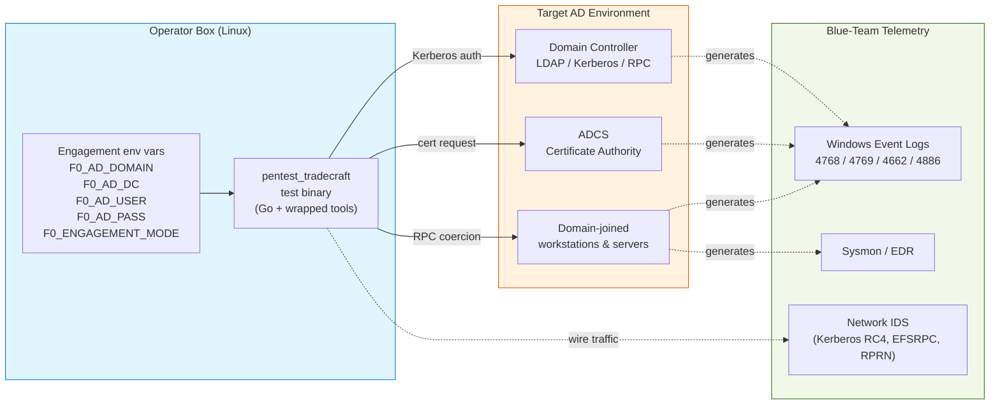

# Pentest Tradecraft Test Suite

> **Status: Preview — not yet integrated with ProjectAchilles.**
> This subcategory is a forward-looking design for the F0RT1KA framework. The tests live here, outside `tests_source/`, so the existing PA ingest pipeline is untouched. PA integration is the next milestone — see [`docs/FUTURE_PA_INTEGRATION.md`](docs/FUTURE_PA_INTEGRATION.md).

## What this is

A library of security tests designed for **ethical hackers and penetration testers** to validate their tradecraft against a target Active Directory environment, and for blue teams to validate that their detection stack catches the techniques real attackers use during an internal engagement.

Unlike the rest of the F0RT1KA catalog, which is **endpoint-deployed** (the test binary runs on the victim), pentest tradecraft tests are **operator-deployed** — the test binary runs from the pentester's Linux workstation (Kali, Parrot, Ubuntu) and exercises techniques against a remote AD target using **standard low-privilege domain credentials**.

This matches reality: a real internal engagement starts with a low-priv foothold and asks "how far can this take me?" Every test in this suite begins from that posture and demonstrates a specific escalation primitive.

## Topology



## Tests in this suite

| # | Test | UUID | MITRE | Wrapped Tool | Score |
|---|------|------|-------|--------------|-------|
| 1 | **BloodHound AD Collection** | [`ac459aed`](ac459aed-0c80-4a73-8bc4-9b9046474e6e/) | T1087.002, T1482, T1069.002 | `bloodhound-python` | 8.6/10 |
| 2 | **Kerberoasting + AS-REP Roasting** | [`7f7c695a`](7f7c695a-880d-48bf-bd4d-f2c76b3a1869/) | T1558.003, T1558.004 | `impacket-GetUserSPNs` / `impacket-GetNPUsers` | 7.8/10 |
| 3 | **ADCS ESC1 — Vulnerable Template Abuse** | [`d09a7a32`](d09a7a32-dc10-45ee-bcec-1e051d48cdff/) | T1649 | `certipy-ad` | 9.1/10 |
| 4 | **PetitPotam Coerced Authentication** | [`a7ed0958`](a7ed0958-272b-4bac-93ab-27d96ac39093/) | T1187, T1557.001 | `impacket-petitpotam` | 8.4/10 |
| 5 | **DPAPI Offline Master-Key Extraction** | [`f3674863`](f3674863-9d8c-4b94-bae8-8d8bd740c71b/) | T1555.004, T1003 | `impacket-dpapi` | 8.7/10 |

All 5 tests follow an identical Go structure: `LoadEngagement → PrecheckCredentials → MustBeInScope → NewLogger → execute → exit code`. Production-mode safety semantics are described in each test's info card and centralized in [`docs/ENGAGEMENT_MODEL.md`](docs/ENGAGEMENT_MODEL.md).

## Engagement model

Every test reads a single set of environment variables that describe the active engagement. The same binary behaves differently in `lab` mode (full execution, noisy, all primitives fire) and `production` mode (scope-enforced, destructive primitives become read-only, full audit logging). See [`docs/ENGAGEMENT_MODEL.md`](docs/ENGAGEMENT_MODEL.md) for the complete contract.

```bash
# Lab engagement — full execution
export F0_ENGAGEMENT_MODE=lab
export F0_AD_DOMAIN=corp.lab.local
export F0_AD_DC=10.10.10.10
export F0_AD_USER=jdoe
export F0_AD_PASS='Lab-Pa$$w0rd'
export F0_AD_SCOPE_CIDR=10.10.10.0/24

./pentest_tradecraft_bloodhound
```

```bash
# Production engagement — scope-enforced, read-only primitives only
export F0_ENGAGEMENT_MODE=production
export F0_AD_DOMAIN=client.corp
export F0_AD_DC=10.50.1.10
export F0_AD_USER=svc_audit
export F0_AD_PASS="$(pass show engagements/2026-client-acme/svc_audit)"
export F0_AD_SCOPE_CIDR=10.50.0.0/16
export F0_ENGAGEMENT_ID="2026-q2-acme"

./pentest_tradecraft_bloodhound
```

## Architecture: Linux-operator binaries that wrap battle-tested tools

Rather than reimplement Kerberos primitives, ADCS protocols, and MS-EFSRPC RPC clients in pure Go, each test embeds the canonical Linux pentest tool (`impacket`, `certipy-ad`, `bloodhound-python`) via `//go:embed` (PyInstaller-frozen for portability), extracts to a temp directory at runtime, and orchestrates execution against the engagement target with engagement env vars wired through.

The Go binary is what F0RT1KA's deployment agent ships, but the actual attack primitive is the well-understood, well-detected Python tool that real pentesters use today. This is **maximally realistic for the operator** (their workflow doesn't change) and **maximally realistic for the blue team** (the wire traffic and detection telemetry is exactly what they'd see from a real engagement).

## Future ProjectAchilles integration

The endgame is a **Pentest Engagements** tab in ProjectAchilles' settings page where consultants can:

1. Create a named engagement (client, scope, time window)
2. Store the low-privilege credentials encrypted at rest
3. Switch the "active engagement" — pentest tradecraft tests run against the active engagement automatically
4. Review per-engagement test result history segregated by engagement

For tomorrow's presentation, that integration is deferred — see [`docs/FUTURE_PA_INTEGRATION.md`](docs/FUTURE_PA_INTEGRATION.md) for the proposed UI mockup and backend wiring.

## Layout

```
pentest_tradecraft/
├── README.md                          # this file
├── go.mod                             # single Go module for the entire suite
├── common/                            # shared engagement primitives
│   ├── engagement.go                  # EngagementConfig + env var loader
│   ├── scope.go                       # production-mode scope enforcement
│   ├── precheck.go                    # credential validation via LDAP bind
│   ├── logger.go                      # structured logging (Schema v2.0)
│   └── README.md
├── docs/
│   ├── ENGAGEMENT_MODEL.md            # full engagement contract + safety semantics
│   └── FUTURE_PA_INTEGRATION.md       # proposed PA settings UI + backend wiring
└── <test-uuid>/
    ├── <uuid>.go                      # Linux operator binary source
    ├── README.md                      # test overview + score
    ├── <uuid>_info.md                 # detailed info card (MITRE, telemetry, detections)
    ├── <uuid>_attack_flow.md          # mermaid attack flow diagram
    └── <uuid>_references.md           # source provenance
```

## Why this is separate from `tests_source/`

`tests_source/` is the production catalog that ProjectAchilles ingests via the `MetadataExtractor` pipeline. This subcategory is **deliberately invisible** to PA's ingest scanner during preview so:

1. The PA platform demo tomorrow shows the current production catalog without unfinished work
2. The engagement-driven test runner is a meaningful architectural addition to PA, not a casual additive change — it deserves its own design pass and review cycle
3. The credential-handling code path in PA needs careful threat modeling before low-priv AD passwords land in PA's data store

When integration lands, tests will migrate to `tests_source/pentest-tradecraft/<uuid>/` and the PA `MetadataExtractor` + UI will be extended in lockstep. Until then, this folder is a Go module that builds and runs independently.

---

**Branch**: `pentest-tradecraft-debut`
**Created**: 2026-05-27
**Author**: F0RT1KA team
