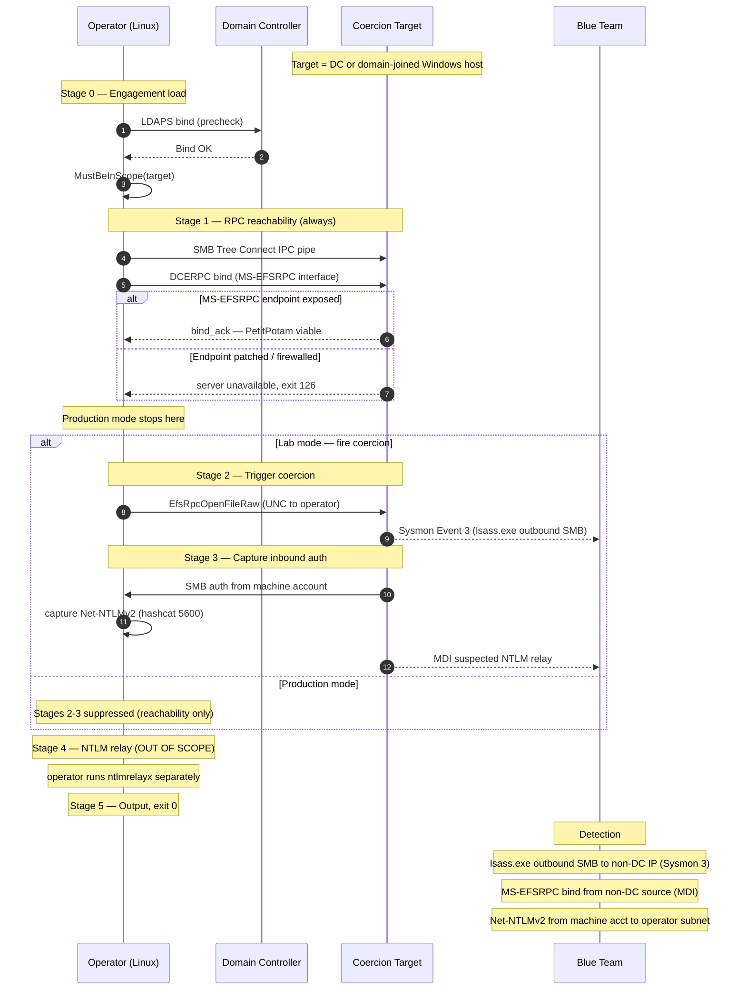

# Attack Flow: PetitPotam Coerced Authentication

## Stage breakdown

| # | Stage | MITRE | Wire | Production mode |
|---|-------|-------|------|-----------------|
| 0 | Engagement validation | — | LDAPS bind to DC | Same |
| 1 | RPC binding reachability | (probe) | DCERPC bind to MS-EFSRPC | Same — last stage in production |
| 2 | Trigger coercion | T1187 | `EfsRpcOpenFileRaw` with UNC path | **Skipped** — `cfg.IsProduction()` short-circuits |
| 3 | Capture inbound auth | T1557.001 | inbound SMB + NTLMSSP from target machine account | **Skipped** |
| 4 | NTLM relay (out of scope) | T1557.001 payoff | relay to LDAP/ADCS/SMB | **Never implemented in this test** — operator's separate `ntlmrelayx` action |

## Decision points

- **Stage 1 fails** (RPC bind error) → exit 126 (positive blue-team signal: endpoint patched/firewalled)
- **Stage 1 succeeds, production mode** → exit 0 (viability confirmed without firing coercion)
- **Stage 2 fails with ACCESS_DENIED** → exit 126 (specific MS-EFSRPC method patched by KB5005413+)
- **Stage 2 succeeds, Stage 3 captures hash** → exit 0 (target fully exposed; report as critical finding)
- **Stage 2 succeeds, Stage 3 times out (no inbound auth in 30s)** → exit 999 (network ACL likely blocking outbound SMB from target to operator subnet — note in engagement report)
- **Stage 4 (relay)** → never reached by this test; operator's deliberate next action

## Detection telemetry timeline

| t+0s | LDAPS bind from operator IP to DC |
| t+1s | DCERPC bind to MS-EFSRPC interface on target |
| t+1.5s | (lab mode) `EfsRpcOpenFileRaw` call lands on target |
| t+1.6s | (lab mode) `lsass.exe` on target resolves UNC, initiates outbound SMB to operator IP |
| t+1.7s | (lab mode) Sysmon Event 3 fires on target — outbound TCP/445 from `lsass.exe` to operator IP |
| t+1.8s | (lab mode) NTLM `NEGOTIATE` from target hits operator's SMB listener |
| t+2.0s | (lab mode) NTLM `AUTHENTICATE_MESSAGE` captured — Net-NTLMv2 written to LOG_DIR |
| t+2-30s | (lab mode) MDI "Suspected NTLM relay attack" alert may fire if Microsoft Defender for Identity is deployed |
| t+2s onward | (production mode) test exits 0 after stage 1; no further wire activity |

## Why stage 4 is out of scope

The captured Net-NTLMv2 from stage 3 is the **input** to the highest-impact PetitPotam attack chain — relay to ADCS via `ntlmrelayx --shadow-credentials`, which writes to `msDS-KeyCredentialLink` and yields a certificate the operator can use to authenticate as the coerced machine account. If that machine account is the DC's, this is full DA escalation in under a minute.

This test deliberately stops short of the relay because:

1. **Relay is destructive in production.** Writing to `msDS-KeyCredentialLink` is a real AD change. Even if the operator promptly removes the key, the SIEM audit log retains the modification event indefinitely.
2. **Relay targets are engagement-specific.** The relay endpoint (which ADCS server? which LDAP DC? which SMB host?) depends on the engagement's authorized scope and the customer's ADCS deployment topology.
3. **Separation of concerns matches operator workflow.** Operators run PetitPotam first to confirm the primitive works, then make a deliberate decision about which relay target to attack with the captured auth.

The relay step belongs in a future `pentest_tradecraft` test focused specifically on NTLM relay (operator's `ntlmrelayx` invocation), with its own scope-aware safety controls.
