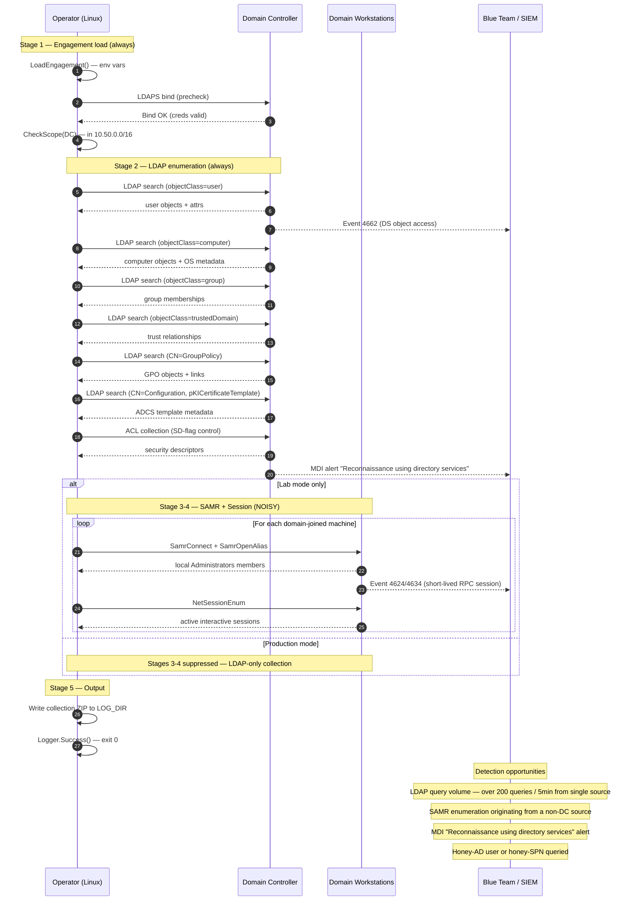

# Attack Flow: BloodHound AD Collection

## Stage breakdown

| # | Stage | MITRE | Wire | Production mode |
|---|-------|-------|------|-----------------|
| 1 | Engagement validation | — | LDAPS bind | Same |
| 2 | LDAP enumeration | T1087.002, T1482, T1069.002, T1018 | LDAPS queries | Same |
| 3 | SAMR LocalGroup | T1069.002 | SMB + RPC to clients | **Skipped** |
| 4 | NetSessionEnum | T1033, T1135 | SMB + RPC to clients | **Skipped** |

## Decision points

- **Stage 1 fails** (bind error) → exit 999, no further stages
- **Stage 2 fails with ACCESS_DENIED** → exit 126 (DC ACLs blocked enumeration; positive blue-team signal)
- **Stage 3/4 fail in production mode** → never reached (skipped)
- **Stage 3/4 fail in lab mode** → logged but non-fatal; stage 2 data is still useful

## Detection telemetry timeline

| t+0s | LDAPS bind from operator IP |
| t+1s | First LDAP query hits DC |
| t+3s | MDI may begin baselining; alert thresholds typically take ~30s |
| t+30s | MDI "Reconnaissance using directory services" alert fires (if deployed) |
| t+2-5min | LDAP enumeration completes |
| t+5-30min (lab mode) | SAMR/Session collection fans out to clients |
| t+30min | Collection ZIP written |
