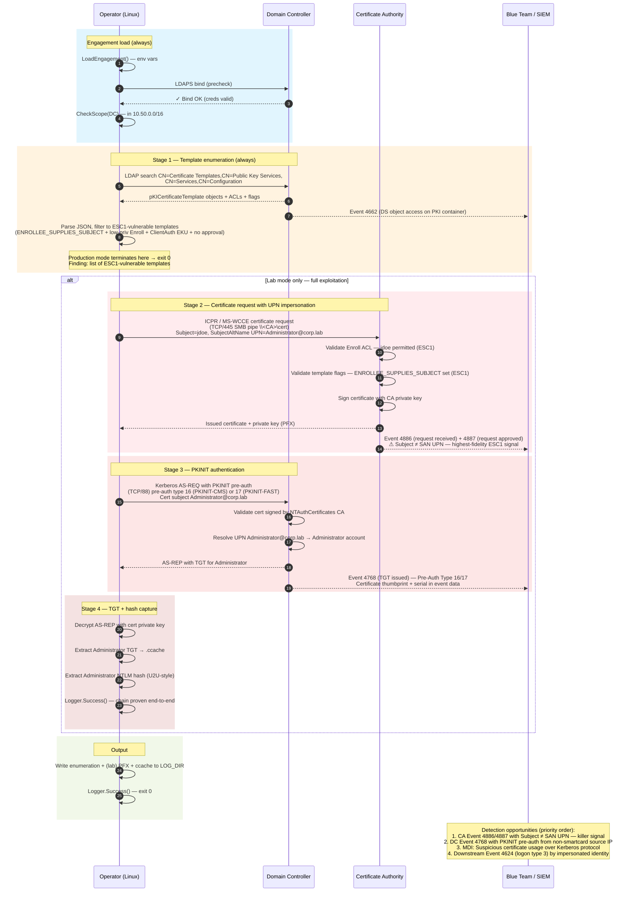

# Attack Flow: ADCS ESC1 — Vulnerable Template Abuse

## Stage breakdown

| # | Stage | MITRE | Wire | Production mode |
|---|-------|-------|------|-----------------|
| 1 | Engagement validation | — | LDAPS bind to DC | Same |
| 1 | Template enumeration | T1649 (recon) | LDAP queries to CN=Configuration | Same — **terminal stage** |
| 2 | Certificate request with impersonation | **T1649** | ICPR/MS-WCCE over SMB pipe to CA (TCP/445) | **Skipped** |
| 3 | PKINIT authentication | T1649 | Kerberos AS-REQ to DC (TCP/88), pre-auth type 16/17 | **Skipped** |
| 4 | TGT + NT hash capture | T1649 | Local decrypt of AS-REP | **Skipped** |

## Decision points

- **Stage 1 fails** (LDAPS bind error) → exit 999, no further stages
- **Stage 1 enumeration returns 0 vulnerable templates** → exit 0, "AD CS hardened against ESC1" — a positive blue-team finding
- **Stage 1 succeeds + production mode** → exit 0, finding reported, no exploitation attempted
- **Stage 2 fails with `MANAGER APPROVAL REQUIRED`** → exit 126 (mitigation applied; positive blue-team signal)
- **Stage 2 fails with `ACCESS_DENIED`** → exit 126 (Enroll ACL not actually permissive — the template was flagged ESC1 by static analysis but the runtime ACL denied us; positive blue-team signal)
- **Stage 3 fails with `KDC_ERR_CERTIFICATE_MISMATCH`** → exit 126 (KB5014754 Full Enforcement enabled — KDC rejects the forged SAN UPN; positive blue-team signal, indicates May 2022 patch is in Full Enforcement mode)
- **Stage 3 fails with `pkinit not supported`** → exit 126 (DC has PKINIT disabled; rare but legitimate hardening)
- **Any stage runtime error** (e.g., network unreachable) → exit 999

## Detection telemetry timeline

| t+0s   | LDAPS bind from operator IP |
| t+1s   | LDAP search of `CN=Certificate Templates,...` — Event 4662 on DC |
| t+5s   | Stage 1 complete — production-mode test exits here |
| t+10s  | (Lab) ICPR request to CA over SMB pipe — Event 4886 on CA |
| t+12s  | (Lab) CA issues cert — Event 4887 on CA, **Subject ≠ SAN UPN** |
| t+15s  | (Lab) Kerberos AS-REQ with PKINIT pre-auth to DC — Event 4768 |
| t+16s  | (Lab) DC issues TGT for Administrator (impersonated) |
| t+30s  | (Lab) MDI may correlate 4886/4887/4768 → "Suspicious certificate usage over Kerberos protocol (ESC1)" alert |
| t+1min | (Lab, downstream) Operator uses TGT — Event 4624 logon type 3 by Administrator from operator IP |
