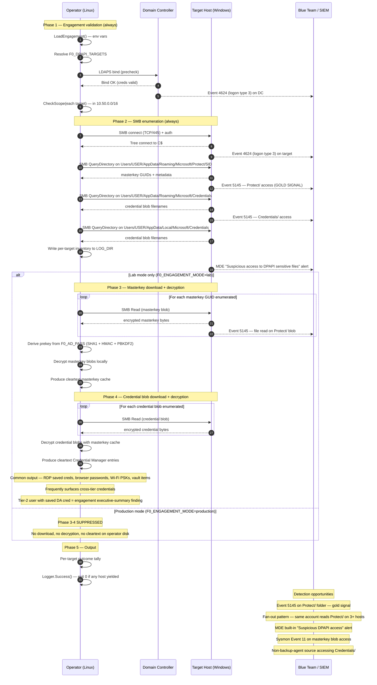

# Attack Flow: DPAPI Offline Master-Key Extraction

## Phase breakdown

| # | Phase | MITRE | Wire | Production mode |
|---|-------|-------|------|-----------------|
| 1 | Engagement validation | — | LDAPS bind to DC | Same |
| 2 | SMB enumeration (Protect/ + Credentials/) | T1555.004, T1003 | SMB QueryDirectory to each target | Same |
| 3 | Masterkey download + decryption | T1003 | SMB Read of masterkey blobs + local decrypt | **Skipped** |
| 4 | Credential blob decryption | T1555.004 | SMB Read of credential blobs + local decrypt | **Skipped** |

## Decision points

- **Phase 1 fails** (bind error, unresolvable target, out-of-scope target) → exit 999, no SMB traffic to any target
- **Phase 2 fails with `STATUS_ACCESS_DENIED` on every target** → exit 126 (share ACLs / Credential Guard / EDR DLP working; positive blue-team signal)
- **Phase 2 fails on some targets, succeeds on others** → those targets contribute their enumeration counts to the finding; failures logged but non-fatal
- **Phase 3 fails in lab mode** (e.g., masterkeys generated under previous password) → enumeration finding still stands; decryption gap logged as engagement note
- **Phase 3-4 in production mode** → never reached (suppressed by `cfg.IsProduction()`)

## Why Event 5145 on `Protect/` is the gold-standard signal

The `\Users\<user>\AppData\Roaming\Microsoft\Protect\` folder is essentially never accessed except by:

1. **The owning user's own DPAPI library calls** (in-process, no SMB, doesn't generate Event 5145)
2. **A small set of backup tools** (Veeam, CommVault, Windows Server Backup) running under known service accounts
3. **Adversaries and pentesters** harvesting DPAPI material

Categories 1 and 2 are filterable (in-process operations don't generate share-access events; backup service accounts are enumerable and excludable). What remains is category 3, with extremely high signal-to-noise.

The detection prerequisite — "Audit Detailed File Share" subcategory enabled — is off by default in Windows. Flipping it on is one of the highest-leverage detection-engineering changes a Windows shop can make: it costs a small amount of Event Log volume (mostly noise that filters cleanly) and unlocks detection for not just this technique but a broader class of "I'm reaching across the network to read someone else's profile" tradecraft.

## Detection telemetry timeline

| t+0s | LDAPS bind from operator IP to DC (Phase 1 precheck) |
| t+1s | First target host SMB tree connect (Phase 2) |
| t+2s | Event 4624 (logon type 3) on first target |
| t+3s | Event 5145 on `Protect/` path — gold-standard signal fires |
| t+5s | Event 5145 on `Credentials/` path |
| t+15s | MDE "Suspicious access to DPAPI sensitive files" alert (if MDE deployed) — fires reliably against enumeration pattern |
| t+30s-2min | Per-target enumeration completes; operator iterates through `F0_DPAPI_TARGETS` |
| t+5min (lab) | Masterkey decryption (Phase 3) completes — cleartext masterkeys in operator's per-target work dir |
| t+10min (lab) | Credential blob decryption (Phase 4) completes — cleartext Credential Manager entries in operator's per-target work dir |
| t+10min (prod) | Test exits with per-target enumeration inventory; no cleartext exfiltrated |
