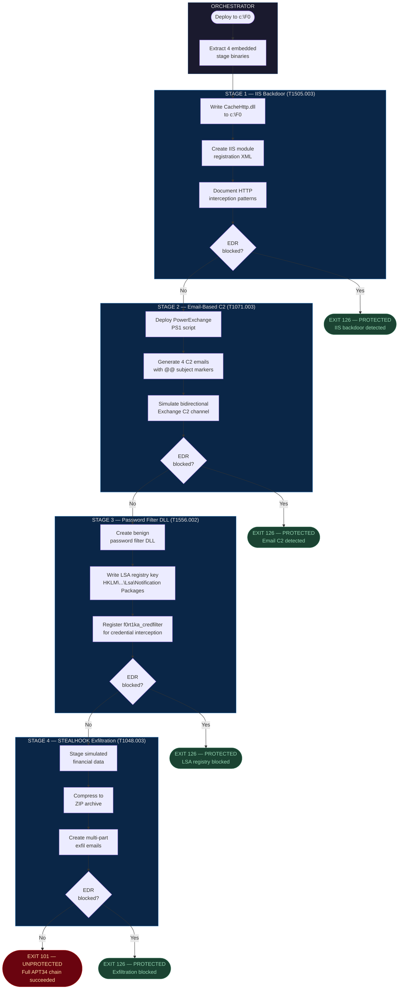
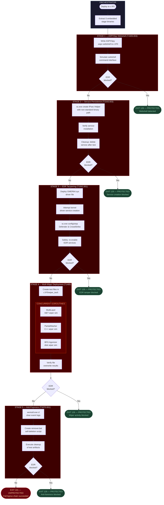
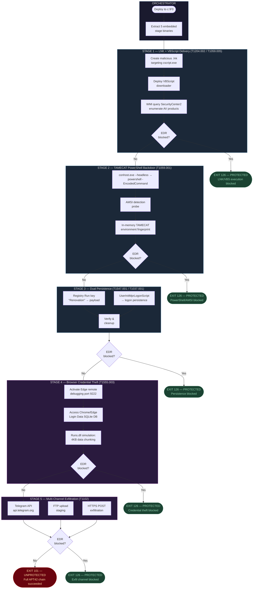

# Iranian APT Multi-Stage Attack Flow Diagrams

## 1. APT34 (OilRig) — Exchange Server Weaponization with Email-Based C2
**UUID**: `5691f436-e630-4fd2-b930-911023cf638f` | **Score**: 8.7/10

---

## 2. Agrius (Pink Sandstorm) — Multi-Wiper Deployment Against Banking Infrastructure
**UUID**: `7d39b861-644d-4f8b-bb19-4faae527a130` | **Score**: 9.0/10

---

## 3. APT42 (Magic Hound) — TAMECAT Fileless Backdoor with Browser Credential Theft
**UUID**: `92b0b4f6-a09b-4c7b-b593-31ce461f804c` | **Score**: 8.7/10

---

## Legend

| Color | Meaning |
|-------|---------|
| Dark blue/red | Stage subgraphs (blue = espionage, red = destructive) |
| Green terminals | PROTECTED outcomes (EDR detection success) |
| Red terminal | UNPROTECTED outcome (full chain execution) |
| Orange highlight | High-risk concurrent operations |

## Combined MITRE ATT&CK Coverage

```mermaid
flowchart LR
    subgraph IA["Initial Access"]
        T1190[T1190<br/>Exploit Public App]
        T1204[T1204.002<br/>Malicious File]
    end

    subgraph EX["Execution"]
        T1059_1[T1059.001<br/>PowerShell]
        T1059_5[T1059.005<br/>VBScript]
    end

    subgraph PE["Persistence"]
        T1505[T1505.003<br/>Web Shell]
        T1543[T1543.003<br/>Windows Service]
        T1547[T1547.001<br/>Registry Run Keys]
        T1037[T1037.001<br/>Logon Script]
    end

    subgraph DE["Defense Evasion"]
        T1562[T1562.001<br/>Disable Tools]
        T1070[T1070.001<br/>Clear Event Logs]
    end

    subgraph CA["Credential Access"]
        T1556[T1556.002<br/>Password Filter DLL]
        T1555[T1555.003<br/>Browser Credentials]
    end

    subgraph CC["Command & Control"]
        T1071[T1071.003<br/>Mail Protocols]
        T1102[T1102<br/>Web Service]
    end

    subgraph XF["Exfiltration"]
        T1048[T1048.003<br/>Alt Protocol]
    end

    subgraph IM["Impact"]
        T1485[T1485<br/>Data Destruction]
        T1561[T1561.001<br/>Disk Content Wipe]
    end

    IA --> EX --> PE --> DE --> CA --> CC --> XF --> IM

    style IA fill:#264653,color:#e9c46a,stroke:#2a9d8f
    style EX fill:#264653,color:#e9c46a,stroke:#2a9d8f
    style PE fill:#264653,color:#e9c46a,stroke:#2a9d8f
    style DE fill:#264653,color:#e9c46a,stroke:#2a9d8f
    style CA fill:#264653,color:#e9c46a,stroke:#2a9d8f
    style CC fill:#264653,color:#e9c46a,stroke:#2a9d8f
    style XF fill:#264653,color:#e9c46a,stroke:#2a9d8f
    style IM fill:#264653,color:#e9c46a,stroke:#2a9d8f
```

